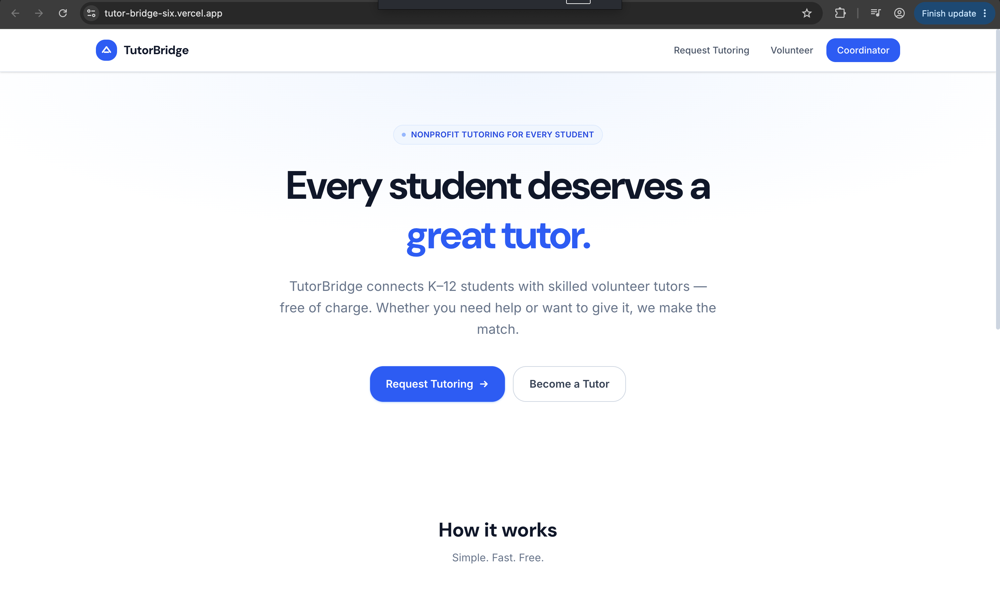
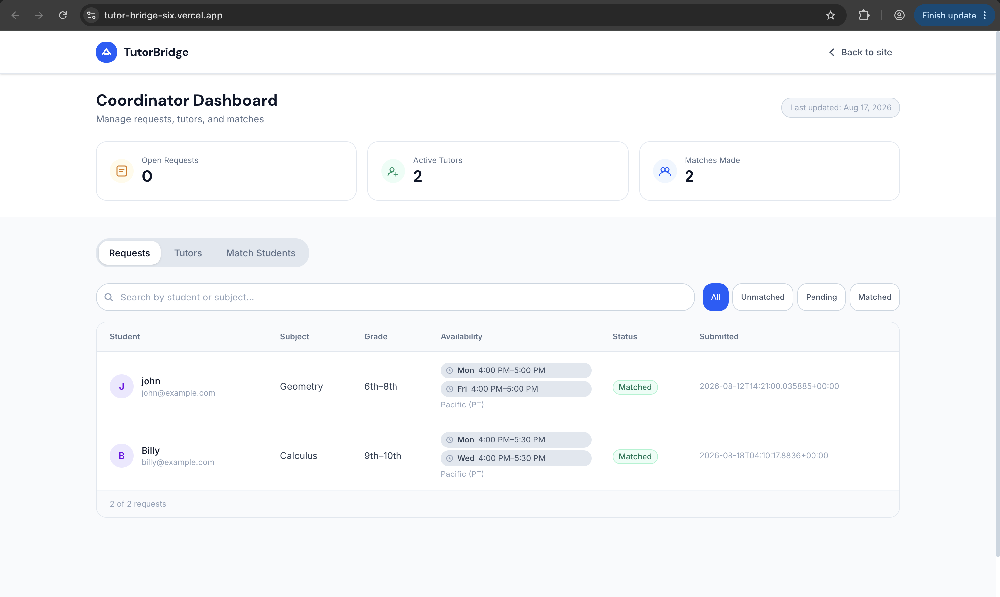
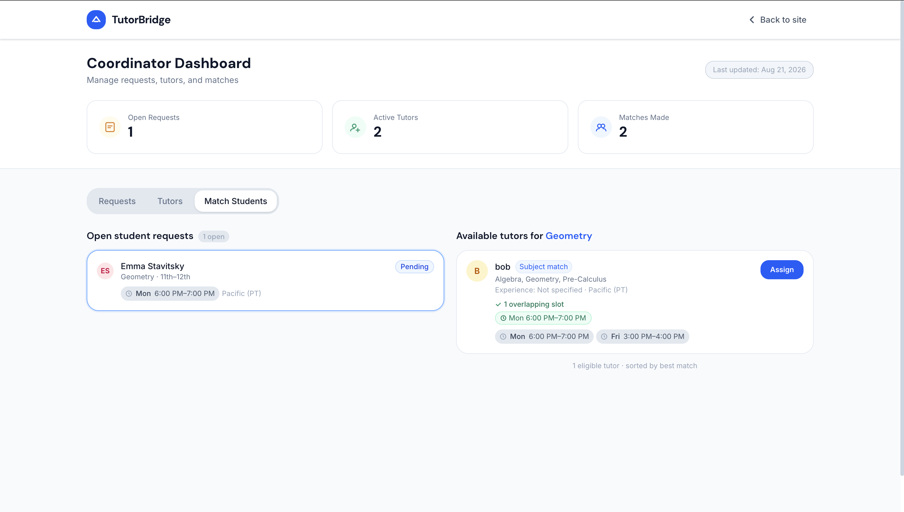

# TutorBridge

TutorBridge — a lightweight tutoring coordination platform prototype that connects K–12 students with volunteer tutors.

## Live Demo

[View the live TutorBridge application](https://tutor-bridge-six.vercel.app/)

One-line: A small full‑stack app for collecting tutoring requests and coordinating volunteer tutors via a Supabase backend.

## How it works

Student Request → Tutor Application → Coordinator Review → Matching → Assignment

## The problem

Many small community programs need an easy way to collect tutoring requests and coordinate volunteer tutors without heavy admin overhead. TutorBridge demonstrates a minimal, privacy‑minded workflow to collect requests/applications and let coordinators approve tutors and assign matches.

## Key features

- Public student request and tutor application forms (anonymous inserts)
- Coordinator authentication and dashboard for reviewing applications
- Approve / Reject workflow for tutors
- Matching recommendations based on subject compatibility and overlapping availability (same timezone)
- Persistent assignments recorded in Supabase with coordinator attribution

## Tech stack

- Frontend: React + TypeScript (Vite)
- Styling: Tailwind CSS
- Backend / Data: Supabase (Postgres, Auth, RLS)
- Deployment: Vercel (frontend)
- Supabase client: `@supabase/supabase-js`

## Architecture

- Frontend (Vite) runs in the browser and uses the publishable Supabase key for public form inserts to `student_requests` and `tutors`.
- Coordinators sign in with Supabase Auth; authenticated requests use the user's session to read protected data and perform coordinator actions.
- Row-Level Security (RLS) policies restrict which authenticated roles can read, update, or delete coordinator-only data; public users may only INSERT into the submission tables and cannot read/update/delete those records.
- Assignments are written by authenticated coordinators and include `assigned_by` (the coordinator's user id).

## Database overview

- `student_requests` — incoming tutoring requests (contact, subject, grade, availability JSONB, notes, status, created_at)
- `tutors` — volunteer applications (contact, subjects array, availability JSONB, bio, status, created_at)
- `coordinators` — coordinator records (`user_id`, `email`, `is_active`) used to gate dashboard access
- `assignments` — records pairing of `request_id` and `tutor_id`, who created it (`assigned_by`), and timestamps

## Security

- Public forms submit anonymously using the publishable Supabase key; those anonymous clients only perform INSERT operations into the submission tables. They cannot read, update, or delete those records.
- Coordinator features require authentication; the frontend verifies the signed‑in user and `coordinators.is_active` before loading private data.
- Assignment inserts include the coordinator's user id so `assigned_by` is recorded on creation.

## Local development

1. Install dependencies

```bash
pnpm install
```

2. Create `.env.local` with these variables (never commit keys):

```
VITE_SUPABASE_URL=https://<your-project>.supabase.co
VITE_SUPABASE_PUBLISHABLE_KEY=<your-anon-publishable-key>
```

3. Run the dev server

```bash
pnpm dev
```

## Required environment variables

- `VITE_SUPABASE_URL`
- `VITE_SUPABASE_PUBLISHABLE_KEY`

## Screenshots

### Landing Page


### Coordinator Dashboard


### Tutor Matching


## Future improvements

1. Move matching and assignment logic into server-side Postgres functions or edge server endpoints for atomicity and simplified client code.
2. Add email/notification workflow for tutors and students upon assignment.
3. Improve availability handling with timezone normalization and expanded cross-timezone matching.
4. Coordinator productivity features: pagination, bulk review, and audit logs.

## Project status

TutorBridge is a functional prototype built for learning and portfolio demonstration.